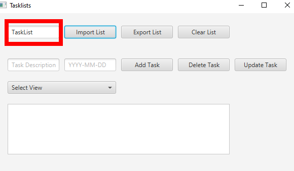
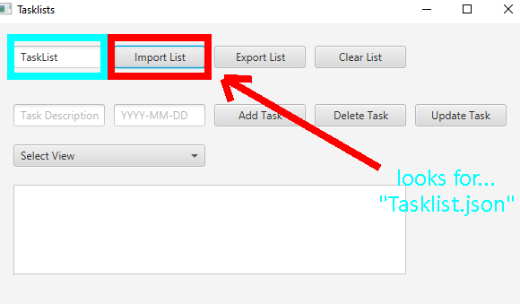
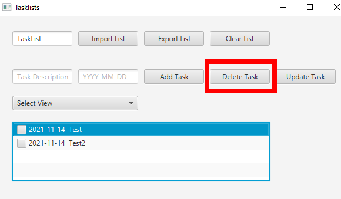
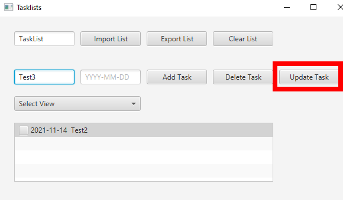
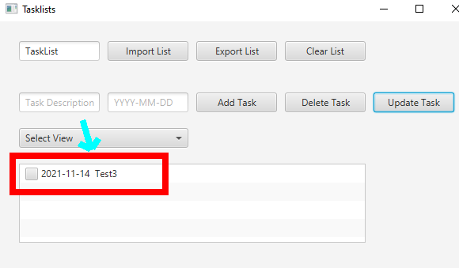

#Task List User Guide
*Created by: Tyler Snowdon*

##Task List Management
Every Task List contains a name and a list of tasks. The name is a simple string of text
that **at most** is 256 characters long. A Task List cannot be empty and must contain **at least** one character
for its name.
###Naming a Task List
To change the name of a Task List, simply edit the text in the top right text-field. This text-field is called the "List Name Text Field".

###Storage System
This system utilizes JSON files for saving Task Lists to an external storage. All JSONs, whether exported or imported, will be placed in the file
location of located at `src/main/resources/ucf/assignments/content/tasklists/`.
####Importing a Task List
To import a Task List set the text of the List Name Text Field to the name of the file you would like to import from (excluding the extension). Then click the "Import List" button, **this will overwrite any existing Task List** so be careful. Your tasks will then load from the respected file. 

If the file has invalid formatting or doesn't exist then the system won't load anything in.
####Exporting a Task List
To export a Task List set the text of the List Name Text Field to the name of the file you would like to export to (excluding extension). Then click the "Export List" button, **this will overwrite any exported list with the same name** so be careful. 

Your tasks will still remain if you wish to change or update them, but remember to re-export if you decide to.
###Clearing a Task List
To clear all lists in a Task List click "Clear List".

**WARNING** This will remove ALL tasks without saving them, and there is no warning message, so this is the best warning you will get.
###Changing Views
To change which kind of Tasks display, select your requested option from the "Select View" dropdown. The following selections will change the view accordingly:

- All: Shows ALL Tasks.
- Complete: Shows only Tasks that were marked as completed.
- Incomplete: Shows only Tasks that were marked as incomplete.
##Task Management
Every Task has a description, a due date, and a status. The description is a string of text describing what must be done. The due date is the physical date and time that task should be completed. And the status defines
whether the task is completed.
###Creating a New Task
To create a new task insert the task's description in the "Task Description" text field as well as its Due Date in the Text field immediately to the right of the Task Description Text Field. The Due Date must be formatted as such `YYYY-MM-DD`. **If** the Due Date is left blank, the system will automatically set the Due Date to the date and time the task was created.

You can have tasks with identical dates and descriptions if you wish to do so. 
You cannot create a task with no description.
###Deleting a Task
To delete a task, select in the "List View Field" near the bottom of the GUI. You will know a task is selected when it is highlighted blue. Once highlighted, click "Delete Task". This will remove the tasks from the current Task List.

###Updating a Task
####Changing Descriptions & Due Dates

To update a task, select in the "List View Field" near the bottom of the GUI. You will know a task is selected when it is highlighted blue. Once highlighted, click "Update Task". 

This will read the contents of the "Task Description" Text Field and the adjacent "Due Date" Text Field (Still formatted as `YYYY-MM-DD`). If either one of those Text Fields have content in them, the system will update the selected task with the new values. If both Text Fields are empty the system will do nothing.
####Changing Status
To change the status of a task simply click the "Check Box" to the right of the Task's Due Date.
- Check: Means completed
- No Check: Means incomplete